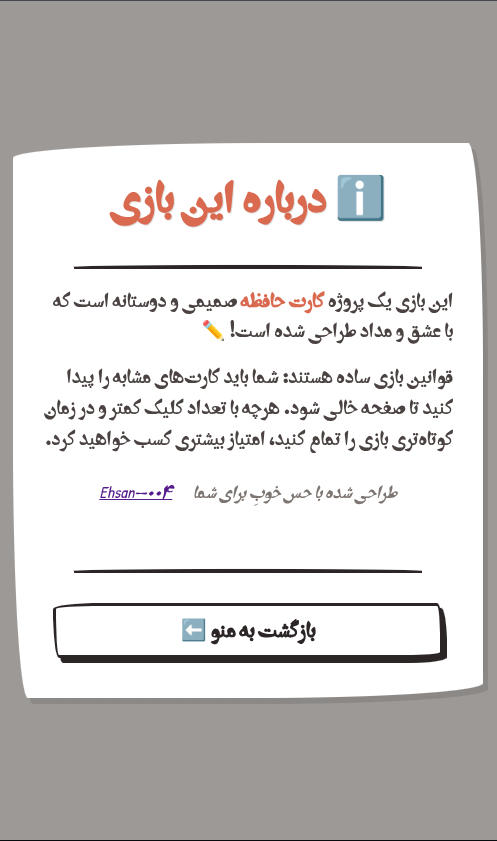
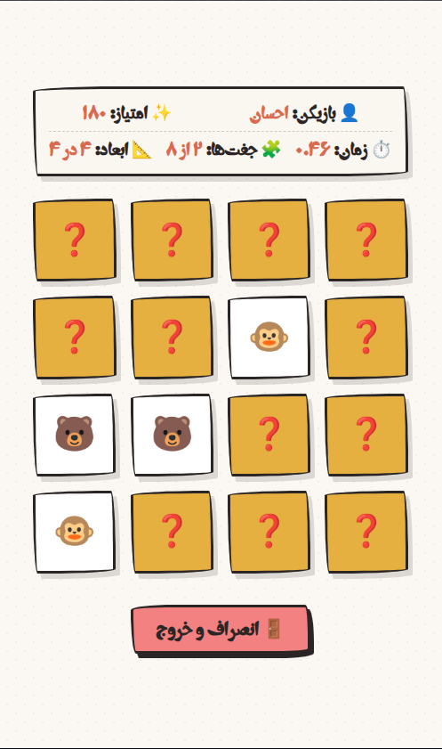

  

   

  
  

---

# Joft-O-Joor

## A Responsive and interactive pair matching game
The UI code is generated by google GEMINI!

### 📸 Screenshots & Preview

 

  
  

## 📝 Description

## ✨ Key Features

## 🛠️ Tech Stack & Architecture

| Layer | Technology |
| --- | --- |
| **Framework / Library** | React.js (Vite) |
| **Styling** | CSS |
| **State Management** | Redux Toolkit |
| **Routing** | React Router v6 |

## 🧑‍💻 Developer

* [Ehsan-004](https://github.com/Ehsan-004)

## 📜 License

This project is open-source and does not have a specific license. Feel free to use, modify, and distribute it as you see fit.
